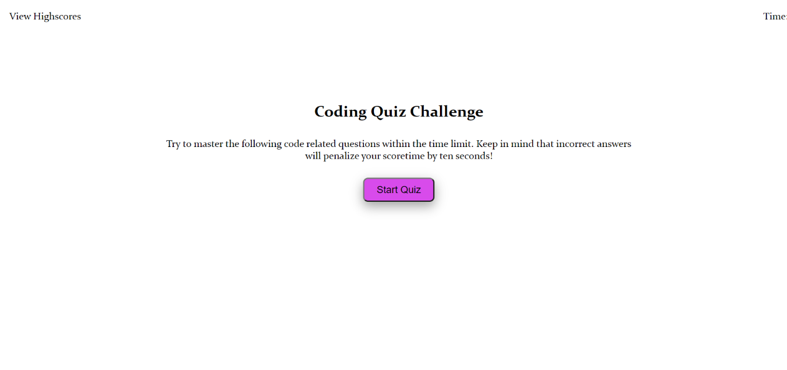

# Code-Quiz

## About the Project

&nbsp;

I created this website for boot camp students whom want to take a timed quiz on Javascript fundamentals, and store their high scores.  

&nbsp;
I was able to achieve this by creating an Array of 6 questions and an Array in each question for their 4 mutliple choice answers. I later called upon them when the Start Quiz button is clicked by applying Math.random. Once the question is chosen then the answers are chosen with Math.random to create a list under the question. Each answer has been turned into a button. When the user clicks an answer they believe is the correct answer, they are immediately told whether it is correct or not because of an arguement. If their choice is correct, the question will be removed from the questions Array to ensure it does not repeat.

&nbsp;

There is a timer, and if it runs out of time the quiz will be over. If the user answers all questions before the time has run out, the quiz will be over and their score will be presented to them. They then are presented with an input to type their initials and Submit it. Once sumitted they will see their initials and current score. I used the local storage to store their score if it is their first time taking the test, and if their current score is higher than any previous scores they may have had. 

&nbsp;

## Complications I Came Across

&nbsp;

Once I tried to determine whether the answer they chose was correct or not I was unable to do so. However, with the help of another coder we attempted to see if I changed the answers as either false or true to no or yes would work. It did. Apparently using a boolean for whether it was correct or not was not working correctly. It was even more difficult because I did not have hidden HTML to make visible. All the new elements were being added with Javascript, and the onclick we had to change a few times before we were able to get the needed output.

&nbsp;

It took me a while to figure out how to stop the timer when they got all the answers correct because even though I made the text content an empty string the timer was still going down. So, once the initials were submitted the score had changed. The last complication I came across was when the Go Back button was clicked. I did not realize that I could set the onclick attribute to completely refresh the page!

---

&nbsp;

## The following image shows how the webpage appears on a desktop

&nbsp;

---

## How the User Can Use the Website

&nbsp;

When you open the website, click the "Start Quiz" button. You will see your timer counting down immediately. Read the question and click the answer you believe is correct. If it says "Wrong!" you need to try again. Continue to do this for the next 5 questions. 

&nbsp;

You will then be told that you are "All done!", and what your score is. You are prompted to enter your initials and submit them. Upon submitting you will see your current score. Your first score will be stored in your local storage for later use. If you try the test more times, your highest old score and your current score will be shown. You can then choose to clear the scores and/or return to the beginning where you will see the "Start Quiz" button again. You can do the quiz as many times as you'd like.

---
&nbsp;
## Links

&nbsp;

[Deployed Application URL]( https://cmcunningham27.github.io/code-quiz/)

[GitHub Repository URL](https://github.com/cmcunningham27/code-quiz)

---
&nbsp;

## Credits

&nbsp;

Cassandra Cunningham, https://github.com/cmcunningham27